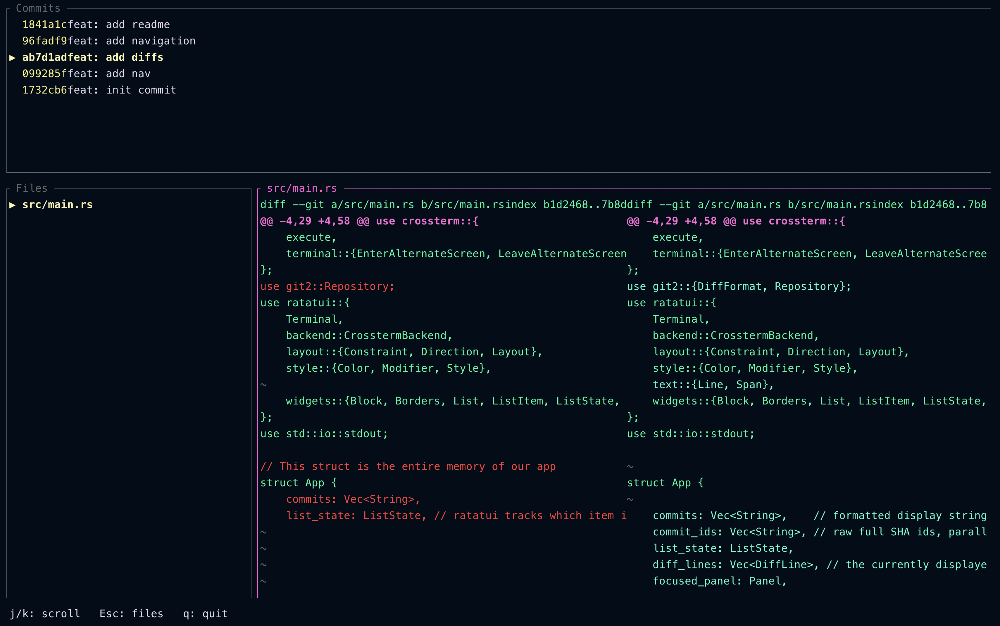

# 🔍 Git Review TUI (gitrview)

> **"Lazygit, but strictly optimized for code reviewers and maintainers."**

A lightning-fast, keyboard-centric terminal user interface (TUI) built in Rust. This tool is designed to make reviewing code (diffs, patches, commits) significantly more efficient than using standard web interfaces or general-purpose Git clients.



## ✨ Why This Exists

While tools like Lazygit are fantastic for *writing* and *managing* code, reviewing code requires a different flow. This tool is tightly focused on the **Review Flow**:
- Instantly navigating commits and changed files.
- Viewing high-quality, side-by-side diffs without leaving the terminal.
- *(Upcoming)* Adding inline comments, staging specific hunks, and getting deep git context (`blame`, history).

## 🚀 Features (Current MVP)

- **Keyboard-First Navigation**: Fly through commits and files using Vim-style bindings (`j`/`k`).
- **Modular UI Panels**: Dedicated views for Commit History, File Tree, and Diff Viewer.
- **Side-by-Side Diffs**: Automatically aligns added and removed lines for easy reading, complete with synchronized vertical scrolling.
- **Premium TUI Experience**: Built with `ratatui` for a flicker-free, dynamically resizing UI.
- **Native Git Integration**: Powered by `git2` for blistering fast repository parsing.

## ⌨️ Keybindings

| Key | Action | Context |
| :--- | :--- | :--- |
| `j` / `↓` | Move selection down / Scroll diff down | Global |
| `k` / `↑` | Move selection up / Scroll diff up | Global |
| `Enter` | Load the diffs for the selected commit | Commit List |
| `Tab` | Focus the next panel | Global |
| `Esc` | Focus the previous panel | Global |
| `q` | Quit the application | Global |

## 🛠️ Getting Started

### Prerequisites
- [Rust & Cargo](https://rustup.rs/) (1.70+)
- A local Git repository to test against.

### Installation
1. Clone this repository:
   ```bash
   git clone [https://github.com/yourusername/git-review-tui.git](https://github.com/yourusername/git-review-tui.git)
   cd git-review-tui
